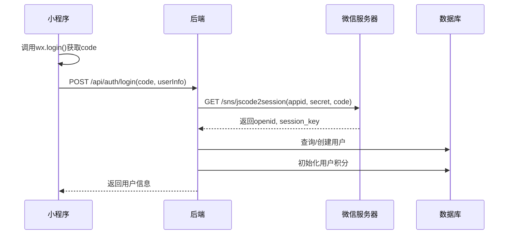
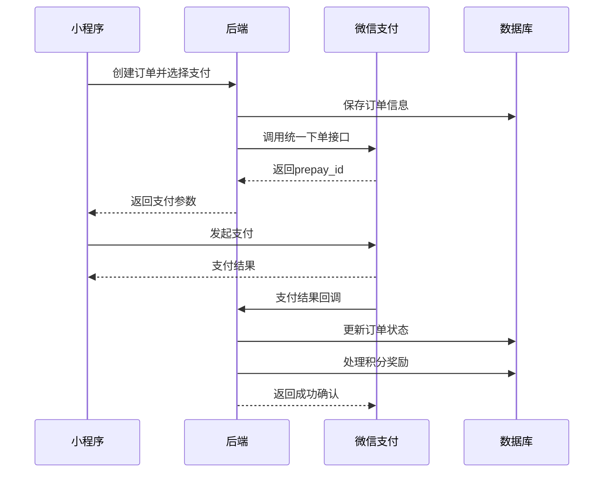
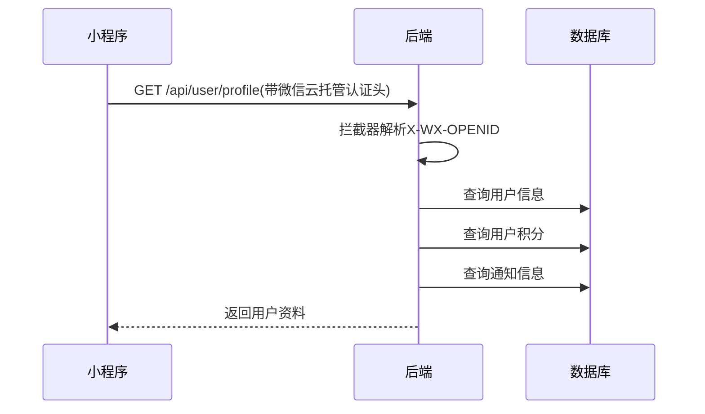
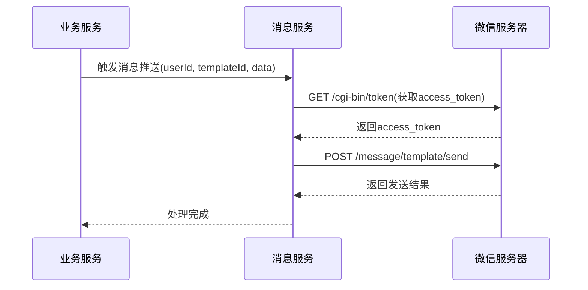

# 小程序后端系统设计文档

## 1. 项目概述

### 1.1 项目背景
为微信小程序提供后端API服务，基于微信云托管实现用户管理、商品管理、积分体系等功能。采用前端callContainer直接调用，简化鉴权处理。

### 1.2 技术栈
- **开发框架**: Spring Boot 3.x
- **JDK版本**: JDK 17
- **部署环境**: 微信云托管
- **ORM框架**: MyBatis-Plus 3.5.x
- **开发工具**: Lombok
- **认证方式**: 微信云托管callContainer鉴权
- **存储服务**: 微信云对象存储(COS)

## 2. 系统架构设计

### 2.1 认证架构调整
- 前端通过callContainer直接调用云函数，无需处理传统JWT
- 微信云托管自动注入用户身份信息到请求头
- 后端通过解析微信云托管的认证头获取用户信息

## 3. 数据库设计（根据实体类调整）

### 3.1 用户表 (user)
```sql
CREATE TABLE `user` (
  `id` bigint NOT NULL AUTO_INCREMENT COMMENT '主键ID',
  `nick_name` varchar(100) DEFAULT NULL COMMENT '用户昵称',
  `wx_id` varchar(128) NOT NULL COMMENT '微信ID，唯一标识',
  `avatar` varchar(500) DEFAULT NULL COMMENT '头像URL',
  `gender` tinyint DEFAULT '0' COMMENT '性别:0-未知,1-男,2-女',
  `city` varchar(100) DEFAULT NULL COMMENT '城市',
  `grade` int DEFAULT '1' COMMENT '用户等级',
  `birthday` varchar(20) DEFAULT NULL COMMENT '生日(yyyy-MM-dd)',
  `email` varchar(100) DEFAULT NULL COMMENT '邮箱',
  `phone` varchar(20) DEFAULT NULL COMMENT '手机号',
  `status` tinyint DEFAULT '1' COMMENT '状态:0-禁用,1-正常',
  `last_login` datetime DEFAULT NULL COMMENT '最后登录时间',
  `gmt_created` datetime DEFAULT CURRENT_TIMESTAMP COMMENT '创建时间',
  `gmt_modified` datetime DEFAULT CURRENT_TIMESTAMP ON UPDATE CURRENT_TIMESTAMP COMMENT '更新时间',
  PRIMARY KEY (`id`),
  UNIQUE KEY `uk_wx_id` (`wx_id`),
  KEY `idx_status` (`status`),
  KEY `idx_grade` (`grade`)
) COMMENT='用户表';
```

### 3.2 用户积分表 (user_point)
```sql
CREATE TABLE `user_point` (
  `id` bigint NOT NULL AUTO_INCREMENT COMMENT '主键ID',
  `user_id` bigint NOT NULL COMMENT '用户ID(关联user.id)',
  `total_point` bigint DEFAULT '0' COMMENT '当前总积分',
  `accumulated_point` bigint DEFAULT '0' COMMENT '累计获得积分',
  `gmt_created` datetime DEFAULT CURRENT_TIMESTAMP COMMENT '创建时间',
  `gmt_modified` datetime DEFAULT CURRENT_TIMESTAMP ON UPDATE CURRENT_TIMESTAMP COMMENT '更新时间',
  PRIMARY KEY (`id`),
  UNIQUE KEY `uk_user_id` (`user_id`),
  KEY `idx_total_point` (`total_point`),
  CONSTRAINT `fk_user_point_user` FOREIGN KEY (`user_id`) REFERENCES `user` (`id`)
) COMMENT='用户积分表';
```

### 3.3 商品表 (product)
```sql
CREATE TABLE `product` (
  `id` bigint NOT NULL AUTO_INCREMENT COMMENT '主键ID',
  `name` varchar(200) NOT NULL COMMENT '商品名称',
  `description` varchar(1024) DEFAULT NULL COMMENT '商品描述',
  `title` varchar(200) DEFAULT NULL COMMENT '商品标题',
  `image` varchar(500) DEFAULT NULL COMMENT '商品图片URL',
  `tags` varchar(500) DEFAULT NULL COMMENT '商品标签(JSON数组)',
  `unit` varchar(8) DEFAULT '件' COMMENT '商品单位',
  `currency` varchar(10) DEFAULT 'CNY' COMMENT '货币类型',
  `category_id` int NOT NULL COMMENT '商品类目ID',
  `status` tinyint DEFAULT '0' COMMENT '状态:0-上架,1-下架,2-删除',
  `sale_price` int DEFAULT '0' COMMENT '销售价格(分)',
  `vip_price` int DEFAULT '0' COMMENT '会员价格(分)',
  `storage` bigint DEFAULT '0' COMMENT '商品库存',
  `cost_price` int DEFAULT '0' COMMENT '成本价格(分)',
  `point` int DEFAULT '0' COMMENT '单位商品产生积分',
  `is_point_convert` tinyint DEFAULT '0' COMMENT '是否可积分兑换:0-否,1-是',
  `gmt_created` datetime DEFAULT CURRENT_TIMESTAMP COMMENT '创建时间',
  `gmt_modified` datetime DEFAULT CURRENT_TIMESTAMP ON UPDATE CURRENT_TIMESTAMP COMMENT '更新时间',
  PRIMARY KEY (`id`),
  KEY `idx_category` (`category_id`),
  KEY `idx_status` (`status`),
  KEY `idx_point_convert` (`is_point_convert`)
) COMMENT='商品表';
```

### 3.4 积分记录表 (point_record)
```sql
CREATE TABLE `point_record` (
  `id` bigint NOT NULL AUTO_INCREMENT COMMENT '主键ID',
  `user_id` bigint NOT NULL COMMENT '用户ID',
  `order_id` bigint DEFAULT NULL COMMENT '订单ID',
  `description` varchar(200) DEFAULT NULL COMMENT '积分变动描述',
  `change_amount` int NOT NULL COMMENT '变动积分值(正数增加，负数减少)',
  `before_amount` int NOT NULL COMMENT '变动前积分',
  `after_amount` int NOT NULL COMMENT '变动后积分',
  `gmt_created` datetime DEFAULT CURRENT_TIMESTAMP COMMENT '创建时间',
  PRIMARY KEY (`id`),
  KEY `idx_user_id` (`user_id`),
  KEY `idx_order_id` (`order_id`),
  KEY `idx_create_time` (`gmt_created`),
  CONSTRAINT `fk_point_record_user` FOREIGN KEY (`user_id`) REFERENCES `user` (`id`)
) COMMENT='积分记录表';
```

### 3.5 商品分类表 (product_category) - 新增
```sql
CREATE TABLE `product_category` (
  `id` int NOT NULL AUTO_INCREMENT COMMENT '主键ID',
  `name` varchar(100) NOT NULL COMMENT '分类名称',
  `parent_id` int DEFAULT '0' COMMENT '父分类ID',
  `level` tinyint DEFAULT '1' COMMENT '分类层级',
  `sort` int DEFAULT '999' COMMENT '排序值',
  `status` tinyint DEFAULT '1' COMMENT '状态:0-禁用,1-启用',
  `gmt_created` datetime DEFAULT CURRENT_TIMESTAMP COMMENT '创建时间',
  `gmt_modified` datetime DEFAULT CURRENT_TIMESTAMP ON UPDATE CURRENT_TIMESTAMP COMMENT '更新时间',
  PRIMARY KEY (`id`),
  KEY `idx_parent` (`parent_id`),
  KEY `idx_status` (`status`)
) COMMENT='商品分类表';
```

### 3.6 订单表 (order)
```sql
CREATE TABLE `order` (
  `id` bigint NOT NULL AUTO_INCREMENT COMMENT '主键ID',
  `user_id` bigint NOT NULL COMMENT '用户ID',
  `order_no` varchar(64) NOT NULL COMMENT '订单号',
  `amount` int NOT NULL COMMENT '订单金额(分)',
  `discount_amount` int DEFAULT '0' COMMENT '折扣金额(分)',
  `pay_amount` int NOT NULL COMMENT '实付金额(分)',
  `merchant_id` bigint NOT NULL COMMENT '商户ID',
  `merchant_name` varchar(200) NOT NULL COMMENT '商户名称',
  `pay_time` datetime DEFAULT NULL COMMENT '支付时间',
  `end_time` datetime DEFAULT NULL COMMENT '完成时间',
  `transaction_id` varchar(64) DEFAULT NULL COMMENT '交易ID',
  `status` tinyint DEFAULT '1' COMMENT '订单状态:1-未支付,2-已支付,3-失败,4-已退款',
  `pay_type` tinyint DEFAULT '0' COMMENT '支付方式:0-余额,1-微信,2-支付宝,3-银行卡',
  `gmt_created` datetime DEFAULT CURRENT_TIMESTAMP COMMENT '创建时间',
  `gmt_modified` datetime DEFAULT CURRENT_TIMESTAMP ON UPDATE CURRENT_TIMESTAMP COMMENT '更新时间',
  PRIMARY KEY (`id`),
  UNIQUE KEY `uk_order_no` (`order_no`),
  KEY `idx_user_id` (`user_id`),
  KEY `idx_status` (`status`),
  KEY `idx_pay_type` (`pay_type`),
  CONSTRAINT `fk_order_user` FOREIGN KEY (`user_id`) REFERENCES `user` (`id`)
) COMMENT='订单表';
```

### 3.7 订单项表 (order_item) - 新增
```sql
CREATE TABLE `order_item` (
  `id` bigint NOT NULL AUTO_INCREMENT COMMENT '主键ID',
  `order_id` bigint NOT NULL COMMENT '订单ID',
  `product_id` bigint NOT NULL COMMENT '商品ID',
  `product_name` varchar(200) NOT NULL COMMENT '商品名称',
  `one_price` int NOT NULL COMMENT '单价(分)',
  `quantity` int NOT NULL COMMENT '数量',
  `total_amount` int NOT NULL COMMENT '总金额(分)',
  `discount_amount` int DEFAULT '0' COMMENT '折扣金额(分)',
  `pay_amount` int NOT NULL COMMENT '实付金额(分)',
  `gmt_created` datetime DEFAULT CURRENT_TIMESTAMP COMMENT '创建时间',
  `gmt_modified` datetime DEFAULT CURRENT_TIMESTAMP ON UPDATE CURRENT_TIMESTAMP COMMENT '更新时间',
  PRIMARY KEY (`id`),
  KEY `idx_order_id` (`order_id`),
  KEY `idx_product_id` (`product_id`),
  CONSTRAINT `fk_order_item_order` FOREIGN KEY (`order_id`) REFERENCES `order` (`id`),
  CONSTRAINT `fk_order_item_product` FOREIGN KEY (`product_id`) REFERENCES `product` (`id`)
) COMMENT='订单项表';
```

## 4. 核心模块设计

### 4.1 认证机制调整

#### 4.1.1 微信云托管认证流程
1. 小程序用户登录后，前端直接通过callContainer调用后端API
2. 微信云托管自动注入`X-WX-OPENID`、`X-WX-UNIONID`等请求头
3. 后端通过拦截器解析用户身份，无需传统JWT处理

#### 4.1.2 用户上下文封装
```java
@Component
public class UserContext {
    
    /**
     * 从微信云托管请求头获取用户信息
     */
    public static UserInfo getCurrentUser() {
        String openid = getHeader("X-WX-OPENID");
        String unionid = getHeader("X-WX-UNIONID");
        // ... 其他用户信息
        
        return UserInfo.builder()
                .wxId(openid)
                .unionId(unionid)
                .build();
    }
    
    /**
     * 获取当前用户ID（wx_id）
     */
    public static String getCurrentUserId() {
        return getHeader("X-WX-OPENID");
    }
}
```

#### 4.1.3 认证拦截器
```java
@Configuration
public class SecurityConfig implements WebMvcConfigurer {
    
    @Override
    public void addInterceptors(InterceptorRegistry registry) {
        registry.addInterceptor(new AuthInterceptor())
                .addPathPatterns("/api/**")
                .excludePathPatterns("/api/auth/**", "/api/public/**");
    }
}

public class AuthInterceptor implements HandlerInterceptor {
    
    @Override
    public boolean preHandle(HttpServletRequest request, 
                           HttpServletResponse response, 
                           Object handler) {
        String wxId = request.getHeader("X-WX-OPENID");
        
        if (StringUtils.isEmpty(wxId)) {
            response.setStatus(HttpStatus.UNAUTHORIZED.value());
            return false;
        }
        
        // 将用户信息存储到ThreadLocal
        UserContext.setCurrentUser(wxId);
        return true;
    }
}
```

### 4.2 用户模块调整

#### 4.2.1 用户登录流程简化
1. 前端调用`wx.login()`获取code
2. 前端通过callContainer调用后端登录接口，传递code
3. 后端验证code并返回用户基本信息
4. 后续所有请求自动携带用户身份

#### 4.2.2 用户实体优化
```java
@EqualsAndHashCode(callSuper = true)
@Entity
@Table(name = "user")
@Data
public class User extends BaseModel {
    
    @Id
    @GeneratedValue(strategy = GenerationType.IDENTITY)
    private Long id;
    
    @Column(name = "nick_name")
    private String nickName;
    
    @Column(name = "wx_id", unique = true, nullable = false)
    private String wxId;
    
    private String avatar;
    private Integer gender;
    private String city;
    private Integer grade = 1;
    private String birthday;
    private String email;
    private String phone;
    
    @Column(name = "status")
    @Convert(converter = AccountStatusEnum.Converter.class)
    private AccountStatusEnum status = AccountStatusEnum.NORMAL;
    
    @Column(name = "last_login")
    private LocalDateTime lastLogin;
    
    // 使用数据库关联查询，不存储为实体属性
}
```

#### 4.2.3 API设计调整
```
POST   /api/auth/login           # 用户登录（验证code）
GET    /api/user/profile         # 获取用户信息（自动鉴权）
PUT    /api/user/profile         # 更新用户信息
GET    /api/user/point           # 获取用户积分信息
GET    /api/user/point-records   # 获取积分记录
```

### 4.3 商品模块调整

#### 4.3.1 商品实体适配
```java
@Data
@Entity
@Table(name = "product")
public class Product extends BaseModel {
    
    @Id
    @GeneratedValue(strategy = GenerationType.IDENTITY)
    private Long id;
    
    private String name;
    
    @Column(length = 1024)
    private String description;
    
    private String title;
    private String image;
    
    @Column(name = "tags")
    @Convert(converter = StringListConverter.class)
    private List<String> tags;
    
    @Column(length = 8)
    private String unit = "件";
    
    private String currency = "CNY";
    
    @Column(name = "category_id")
    private Integer categoryId;
    
    @Column(name = "status")
    @Convert(converter = ProductStatusEnum.Converter.class)
    private ProductStatusEnum status = ProductStatusEnum.ON_SHELF;
    
    @Column(name = "sale_price")
    private Integer salePrice = 0;
    
    @Column(name = "vip_price")
    private Integer vipPrice = 0;
    
    private Long storage = 0L;
    
    @Column(name = "cost_price")
    private Integer costPrice = 0;
    
    private Integer point = 0;
    
    @Column(name = "is_point_convert")
    private Boolean isPointConvert = false;
}
```

#### 4.3.2 商品分类实体
```java
@Data
@Entity
@Table(name = "product_category")
public class ProductCategory extends BaseModel {
    
    @Id
    @GeneratedValue(strategy = GenerationType.IDENTITY)
    private Integer id;
    
    private String name;
    
    @Column(name = "parent_id")
    private Integer parentId = 0;
    
    private Integer level = 1;
    private Integer sort = 999;
    private Integer status = 1;
}
```

### 4.4 积分模块调整

#### 4.4.1 积分记录实体适配
```java
@Data
@Entity
@Table(name = "point_record")
public class PointRecord {
    
    @Id
    @GeneratedValue(strategy = GenerationType.IDENTITY)
    @Column(name = "id")
    private Long id;
    
    @Column(name = "user_id")
    private String userId;
    
    @Column(name = "order_id")
    private String orderId;
    
    private String description;
    
    @Column(name = "gmt_created")
    private LocalDateTime gmtCreated = LocalDateTime.now();
    
    @Column(name = "change_amount")
    private Integer changeAmount;
    
    @Column(name = "before_amount")
    private Integer beforeAmount;
    
    @Column(name = "after_amount")
    private Integer afterAmount;
}
```

#### 4.4.2 积分服务逻辑
```java
@Service
public class PointService {
    
    @Autowired
    private UserPointMapper userPointMapper;
    
    @Autowired
    private PointRecordMapper pointRecordMapper;
    
    @Transactional
    public void addPoint(String userId, Integer points, String description, String orderId) {
        // 查询用户当前积分
        UserPoint userPoint = userPointMapper.selectByUserId(userId);
        if (userPoint == null) {
            userPoint = initUserPoint(userId);
        }
        
        // 创建积分记录
        PointRecord record = new PointRecord();
        record.setUserId(userId);
        record.setOrderId(orderId);
        record.setDescription(description);
        record.setChangeAmount(points);
        record.setBeforeAmount(userPoint.getTotalPoint().intValue());
        record.setAfterAmount(userPoint.getTotalPoint().intValue() + points);
        record.setGmtCreated(LocalDateTime.now());
        pointRecordMapper.insert(record);
        
        // 更新用户积分
        userPoint.setTotalPoint(userPoint.getTotalPoint() + points);
        userPoint.setAccumulatedPoint(userPoint.getAccumulatedPoint() + points);
        userPoint.setGmtModified(LocalDateTime.now());
        userPointMapper.updateById(userPoint);
    }
}
```

### 4.5 通知模块设计

#### 4.5.1 通知实体
```java
@Data
@Entity
@Table(name = "notification")
public class Notification extends BaseModel {
    
    @Id
    @GeneratedValue(strategy = GenerationType.IDENTITY)
    private Long id;
    
    @Column(name = "user_id")
    private String userId;
    
    @Column(name = "type")
    @Convert(converter = NotificationTypeEnum.Converter.class)
    private NotificationTypeEnum type;
    
    private String title;
    
    @Column(length = 500)
    private String content;
    
    @Column(name = "is_read")
    private Boolean isRead = false;
    
    @Column(name = "read_time")
    private LocalDateTime readTime;
}
```

### 4.6 订单模块设计

#### 4.6.1 订单实体
```java
@Data
@Entity
@Table(name = "order")
public class Order extends BaseModel {
    
    @Id
    @GeneratedValue(strategy = GenerationType.IDENTITY)
    private Long id;
    
    @Column(name = "user_id")
    private Long userId;
    
    @Column(name = "order_no", unique = true, nullable = false)
    private String orderNo;
    
    private Integer amount;
    
    @Column(name = "discount_amount")
    private Integer discountAmount = 0;
    
    @Column(name = "pay_amount")
    private Integer payAmount;
    
    @Column(name = "merchant_id")
    private Long merchantId;
    
    @Column(name = "merchant_name")
    private String merchantName;
    
    @Column(name = "pay_time")
    private LocalDateTime payTime;
    
    @Column(name = "end_time")
    private LocalDateTime endTime;
    
    @Column(name = "transaction_id")
    private String transactionId;
    
    @Column(name = "status")
    @Convert(converter = OrderTypeEnum.Converter.class)
    private OrderTypeEnum status = OrderTypeEnum.NONPAYMENT;
    
    @Column(name = "pay_type")
    @Convert(converter = OrderOptionEnum.Converter.class)
    private OrderOptionEnum payType = OrderOptionEnum.BALANCE;
}
```

#### 4.6.2 订单项实体
```java
@Data
@Entity
@Table(name = "order_item")
public class OrderItem extends BaseModel {
    
    @Id
    @GeneratedValue(strategy = GenerationType.IDENTITY)
    private Long id;
    
    @Column(name = "order_id")
    private Long orderId;
    
    @Column(name = "product_id")
    private Long productId;
    
    @Column(name = "product_name")
    private String productName;
    
    @Column(name = "one_price")
    private Integer onePrice;
    
    private Integer quantity;
    
    @Column(name = "total_amount")
    private Integer totalAmount;
    
    @Column(name = "discount_amount")
    private Integer discountAmount = 0;
    
    @Column(name = "pay_amount")
    private Integer payAmount;
}
```

#### 4.6.3 订单服务逻辑
```java
@Service
public class OrderService {
    
    @Autowired
    private OrderMapper orderMapper;
    
    @Autowired
    private OrderItemMapper orderItemMapper;
    
    @Autowired
    private PointService pointService;
    
    @Transactional
    public Order createOrder(Long userId, List<OrderItemRequest> items, OrderOptionEnum payType) {
        // 生成订单号
        String orderNo = generateOrderNo();
        
        // 创建订单
        Order order = new Order();
        order.setUserId(userId);
        order.setOrderNo(orderNo);
        order.setStatus(OrderTypeEnum.NONPAYMENT);
        order.setPayType(payType);
        
        // 计算订单金额
        Integer totalAmount = items.stream()
                .mapToInt(item -> item.getPrice() * item.getQuantity())
                .sum();
        order.setAmount(totalAmount);
        order.setPayAmount(totalAmount);
        
        // 设置商户信息
        order.setMerchantId(1L); // 默认商户
        order.setMerchantName("官方商城");
        
        orderMapper.insert(order);
        
        // 创建订单项
        for (OrderItemRequest item : items) {
            OrderItem orderItem = new OrderItem();
            orderItem.setOrderId(order.getId());
            orderItem.setProductId(item.getProductId());
            orderItem.setProductName(item.getProductName());
            orderItem.setOnePrice(item.getPrice());
            orderItem.setQuantity(item.getQuantity());
            orderItem.setTotalAmount(item.getPrice() * item.getQuantity());
            orderItem.setPayAmount(orderItem.getTotalAmount());
            orderItemMapper.insert(orderItem);
        }
        
        return order;
    }
    
    @Transactional
    public void paySuccess(String orderNo, String transactionId) {
        // 查询订单
        Order order = orderMapper.selectByOrderNo(orderNo);
        if (order == null || order.getStatus() != OrderTypeEnum.NONPAYMENT) {
            throw new BusinessException("订单状态异常");
        }
        
        // 更新订单状态
        order.setStatus(OrderTypeEnum.PAID);
        order.setTransactionId(transactionId);
        order.setPayTime(LocalDateTime.now());
        orderMapper.updateById(order);
        
        // 处理积分奖励
        List<OrderItem> items = orderItemMapper.selectByOrderId(order.getId());
        for (OrderItem item : items) {
            // 查询商品积分设置
            Product product = productService.getById(item.getProductId());
            if (product != null && product.getPoint() > 0) {
                int pointReward = product.getPoint() * item.getQuantity();
                pointService.addPoint(order.getUserId(), pointReward, 
                        "购买商品奖励积分", orderNo);
            }
        }
    }
    
    private String generateOrderNo() {
        return "ORD" + System.currentTimeMillis() + RandomUtils.nextInt(100, 999);
    }
}
```

## 5. 微信云集成与API交互设计

### 5.1 callContainer调用示例
前端直接调用，无需处理认证：
```javascript
// 前端调用示例
wx.cloud.callContainer({
  config: {
    env: 'your-env-id'
  },
  path: '/api/user/profile',
  method: 'GET',
  success: res => {
    console.log(res.data)
  }
})
```

### 5.2 后端接收处理
```java
@RestController
@RequestMapping("/api/user")
public class UserController {
    
    @GetMapping("/profile")
    public Result<UserProfileVO> getProfile(HttpServletRequest request) {
        // 从请求头获取用户信息
        String wxId = request.getHeader("X-WX-OPENID");
        User user = userService.getByWxId(wxId);
        
        UserProfileVO profile = UserProfileVO.builder()
                .nickName(user.getNickName())
                .avatar(user.getAvatar())
                .grade(user.getGrade())
                .point(userPointService.getUserPoint(wxId))
                .build();
        
        return Result.success(profile);
    }
}
```

### 5.3 微信登录流程实现

#### 5.3.1 登录接口实现
```java
@RestController
@RequestMapping("/api/auth")
public class AuthController {
    
    @Autowired
    private WxService wxService;
    
    @Autowired
    private UserService userService;
    
    @PostMapping("/login")
    public Result<LoginResponse> login(@RequestBody LoginRequest request) {
        // 1. 验证微信code
        WxSessionResult sessionResult = wxService.code2Session(request.getCode());
        
        // 2. 查询或创建用户
        User user = userService.getOrCreateByWxId(
                sessionResult.getOpenid(), 
                request.getNickName(), 
                request.getAvatar(),
                request.getGender()
        );
        
        // 3. 返回用户信息
        LoginResponse response = LoginResponse.builder()
                .userId(user.getId())
                .wxId(user.getWxId())
                .nickName(user.getNickName())
                .avatar(user.getAvatar())
                .build();
        
        return Result.success(response);
    }
}
```

#### 5.3.2 微信API调用服务
```java
@Service
public class WxService {
    
    @Value("${wx.appid}")
    private String appId;
    
    @Value("${wx.secret}")
    private String appSecret;
    
    @Autowired
    private RestTemplate restTemplate;
    
    public WxSessionResult code2Session(String code) {
        String url = "https://api.weixin.qq.com/sns/jscode2session" +
                "?appid=" + appId +
                "&secret=" + appSecret +
                "&js_code=" + code +
                "&grant_type=authorization_code";
        
        WxSessionResult result = restTemplate.getForObject(url, WxSessionResult.class);
        
        if (result == null || result.getErrcode() != null) {
            throw new BusinessException("微信登录失败: " + result.getErrmsg());
        }
        
        return result;
    }
    
    public WxUnifiedOrderResult unifiedOrder(WxPayRequest request) {
        // 构建统一下单请求
        Map<String, String> params = new HashMap<>();
        params.put("appid", appId);
        params.put("mch_id", mchId);
        params.put("nonce_str", generateNonceStr());
        params.put("body", request.getBody());
        params.put("out_trade_no", request.getOutTradeNo());
        params.put("total_fee", request.getTotalFee().toString());
        params.put("spbill_create_ip", getClientIp());
        params.put("notify_url", request.getNotifyUrl());
        params.put("trade_type", "JSAPI");
        params.put("openid", request.getOpenid());
        
        // 签名
        String sign = generateSign(params);
        params.put("sign", sign);
        
        // 发送请求
        String xml = MapToXmlUtils.mapToXml(params);
        String responseXml = restTemplate.postForObject(WX_PAY_UNIFIEDORDER_URL, xml, String.class);
        
        // 解析响应
        WxUnifiedOrderResult result = XmlToMapUtils.xmlToMap(responseXml, WxUnifiedOrderResult.class);
        
        if (!"SUCCESS".equals(result.getReturnCode()) || !"SUCCESS".equals(result.getResultCode())) {
            throw new BusinessException("微信统一下单失败: " + result.getReturnMsg());
        }
        
        return result;
    }
}
```

#### 5.3.3 微信支付回调处理
```java
@RestController
@RequestMapping("/api/wx/pay")
public class WxPayController {
    
    @Autowired
    private OrderService orderService;
    
    @PostMapping("/notify")
    public String payNotify(HttpServletRequest request) {
        try {
            // 1. 读取回调内容
            StringBuilder sb = new StringBuilder();
            BufferedReader reader = request.getReader();
            String line;
            while ((line = reader.readLine()) != null) {
                sb.append(line);
            }
            
            // 2. 解析XML
            Map<String, String> params = XmlToMapUtils.xmlToMap(sb.toString());
            
            // 3. 验证签名
            if (!verifySign(params)) {
                return buildFailResponse("签名验证失败");
            }
            
            // 4. 处理业务逻辑
            if ("SUCCESS".equals(params.get("result_code"))) {
                String orderNo = params.get("out_trade_no");
                String transactionId = params.get("transaction_id");
                
                // 更新订单状态
                orderService.paySuccess(orderNo, transactionId);
            }
            
            // 5. 返回成功响应
            return buildSuccessResponse();
            
        } catch (Exception e) {
            log.error("微信支付回调处理失败", e);
            return buildFailResponse("处理失败");
        }
    }
    
    private String buildSuccessResponse() {
        Map<String, String> response = new HashMap<>();
        response.put("return_code", "SUCCESS");
        response.put("return_msg", "OK");
        return MapToXmlUtils.mapToXml(response);
    }
}
```

#### 5.3.4 流程图


### 5.4 微信支付流程实现

#### 5.4.1 创建支付接口
```java
@RestController
@RequestMapping("/api/pay")
public class PayController {
    
    @Autowired
    private WxService wxService;
    
    @Autowired
    private OrderService orderService;
    
    @PostMapping("/wechat/create")
    public Result<WxPayResponse> createWechatPay(@RequestBody WxPayRequest request) {
        // 1. 查询订单
        Order order = orderService.getById(request.getOrderId());
        if (order == null || order.getStatus() != OrderTypeEnum.NONPAYMENT) {
            throw new BusinessException("订单状态异常");
        }
        
        // 2. 构建统一下单请求
        WxPayRequest wxPayRequest = new WxPayRequest();
        wxPayRequest.setBody("商品购买");
        wxPayRequest.setOutTradeNo(order.getOrderNo());
        wxPayRequest.setTotalFee(order.getPayAmount());
        wxPayRequest.setNotifyUrl("https://your-domain.com/api/wx/pay/notify");
        wxPayRequest.setOpenid(request.getOpenid());
        
        // 3. 调用微信统一下单
        WxUnifiedOrderResult result = wxService.unifiedOrder(wxPayRequest);
        
        // 4. 构建支付参数
        Map<String, String> payParams = new HashMap<>();
        payParams.put("appId", result.getAppid());
        payParams.put("timeStamp", String.valueOf(System.currentTimeMillis() / 1000));
        payParams.put("nonceStr", generateNonceStr());
        payParams.put("package", "prepay_id=" + result.getPrepayId());
        payParams.put("signType", "MD5");
        
        // 5. 签名
        String paySign = generateSign(payParams);
        payParams.put("paySign", paySign);
        
        return Result.success(new WxPayResponse(payParams));
    }
}
```

#### 5.4.2 支付流程图


### 5.5 用户信息获取流程

#### 5.5.1 用户信息获取实现
```java
@Service
public class UserService {
    
    public UserProfileVo getUserProfile(String wxId) {
        // 1. 查询用户基本信息
        User user = getByWxId(wxId);
        if (user == null) {
            throw new BusinessException("用户不存在");
        }
        
        // 2. 查询用户积分信息
        UserPoint userPoint = userPointService.getByUserId(user.getId());
        
        // 3. 查询用户通知信息
        List<Notification> notifications = notificationService.getUnreadNotifications(user.getId());
        
        // 4. 组装返回信息
        return UserProfileVo.builder()
                .userId(user.getId())
                .wxId(user.getWxId())
                .nickName(user.getNickName())
                .avatar(user.getAvatar())
                .gender(user.getGender())
                .city(user.getCity())
                .grade(user.getGrade())
                .totalPoint(userPoint != null ? userPoint.getTotalPoint() : 0)
                .unreadNotifications(notifications.size())
                .build();
    }
}
```

#### 5.5.2 用户信息获取流程图


### 5.6 消息推送流程

#### 5.6.1 消息推送实现
```java
@Service
public class MessageService {
    
    @Autowired
    private WxService wxService;
    
    public void sendTemplateMessage(String openid, String templateId, Map<String, String> data, String page) {
        // 1. 获取access_token
        String accessToken = wxService.getAccessToken();
        
        // 2. 构建消息内容
        WxTemplateMessage message = new WxTemplateMessage();
        message.setTouser(openid);
        message.setTemplateId(templateId);
        message.setPage(page);
        message.setData(buildTemplateData(data));
        
        // 3. 发送消息
        WxMessageResult result = wxService.sendTemplateMessage(accessToken, message);
        
        if (result.getErrcode() != 0) {
            log.error("发送模板消息失败: {}", result.getErrmsg());
        }
    }
    
    private Map<String, WxTemplateData> buildTemplateData(Map<String, String> data) {
        Map<String, WxTemplateData> templateData = new HashMap<>();
        for (Map.Entry<String, String> entry : data.entrySet()) {
            templateData.put(entry.getKey(), new WxTemplateData(entry.getValue()));
        }
        return templateData;
    }
}
```

#### 5.6.2 消息推送流程图


## 6. 枚举类设计

### 6.1 账户状态枚举
```java
public enum AccountStatusEnum {
    ACTIVE(0, "激活"),
    INACTIVE(1, "未激活"),
    SUSPENDED(2, "暂停"),
    BANNED(3, "封禁"),
    DELETED(4, "删除");
    
    @Converter
    public static class Converter implements AttributeConverter<AccountStatusEnum, Integer> {
        @Override
        public Integer convertToDatabaseColumn(AccountStatusEnum attribute) {
            return attribute != null ? attribute.code : null;
        }
        
        @Override
        public AccountStatusEnum convertToEntityAttribute(Integer dbData) {
            return Arrays.stream(values())
                    .filter(e -> e.code.equals(dbData))
                    .findFirst()
                    .orElse(null);
        }
    }
}
```

### 6.2 商品状态枚举
```java
public enum ProductStatusEnum {
    SELL(0, "上架"),
    SOLD_OUT(1, "下架"),
    DELETED(2, "删除");
    
    // 转换器实现类似AccountStatusEnum
}
```

### 6.3 订单状态枚举
```java
public enum OrderTypeEnum {
    NONPAYMENT(1, "未支付"),
    PAID(2, "已支付"),
    FAILURE(3, "失败"),
    REFUNDED(4, "已退款");
    
    // 转换器实现类似AccountStatusEnum
}
```

### 6.4 支付方式枚举
```java
public enum OrderOptionEnum {
    BALANCE(0, "余额支付"),
    WECHAT(1, "微信支付"),
    ALIPAY(2, "支付宝"),
    BANKCARD(3, "银行卡");
    
    // 转换器实现类似AccountStatusEnum
}
```

## 7. 类型处理器配置

### 7.1 MyBatis-Plus类型处理器
```java
@Configuration
@MapperScan("com.yourpackage.mapper")
public class MyBatisPlusConfig {
    
    @Bean
    public MybatisPlusInterceptor mybatisPlusInterceptor() {
        MybatisPlusInterceptor interceptor = new MybatisPlusInterceptor();
        
        // 分页插件
        interceptor.addInnerInterceptor(new PaginationInnerInterceptor());
        
        // 乐观锁插件
        interceptor.addInnerInterceptor(new OptimisticLockerInnerInterceptor());
        
        return interceptor;
    }
    
    @Bean
    public ConfigurationCustomizer configurationCustomizer() {
        return configuration -> {
            // 注册自定义类型处理器
            configuration.getTypeHandlerRegistry().register(AccountStatusEnum.class, 
                AccountStatusTypeHandler.class);
            configuration.getTypeHandlerRegistry().register(ProductStatusEnum.class,
                ProductStatusTypeHandler.class);
        };
    }
}
```

## 8. API接口设计

### 8.1 用户相关接口
```
# 认证相关
POST   /api/auth/login          # 用户登录
POST   /api/auth/check-session  # 检查会话

# 用户信息
GET    /api/user/profile        # 获取用户资料(自动鉴权)
PUT    /api/user/profile        # 更新用户资料
GET    /api/user/point          # 获取用户积分
GET    /api/user/point-records  # 积分记录列表

# 通知
GET    /api/user/notifications  # 用户通知列表
PUT    /api/user/notifications/{id}/read  # 标记已读
```

### 8.2 商品相关接口
```
# 商品分类
GET    /api/categories          # 分类列表
GET    /api/categories/{id}     # 分类详情

# 商品管理
GET    /api/products            # 商品列表(分页)
GET    /api/products/{id}       # 商品详情
GET    /api/products/search     # 商品搜索

# 管理员接口
POST   /api/admin/products      # 创建商品
PUT    /api/admin/products/{id} # 更新商品
DELETE /api/admin/products/{id} # 删除商品
PUT    /api/admin/products/{id}/status  # 修改状态
PUT    /api/admin/products/{id}/stock   # 调整库存
```

### 8.3 订单相关接口
```
# 订单管理
POST   /api/orders              # 创建订单
GET    /api/orders              # 订单列表
GET    /api/orders/{id}         # 订单详情
POST   /api/orders/{id}/cancel  # 取消订单
GET    /api/orders/{id}/items   # 订单项列表
```

### 8.4 支付相关接口
```
# 支付管理
POST   /api/pay/wechat/create   # 创建微信支付
POST   /api/wx/pay/notify       # 微信支付回调
POST   /api/pay/alipay/create   # 创建支付宝支付(可选)
POST   /api/pay/balance/create  # 余额支付
GET    /api/pay/status/{orderId} # 查询支付状态
```

### 8.5 微信API调用接口
```
# 微信服务端API
GET    /sns/jscode2session       # 获取openid和session_key
POST   /pay/unifiedorder         # 统一下单
POST   /cgi-bin/message/template/send # 发送模板消息
GET    /cgi-bin/token            # 获取access_token
```

### 8.6 积分相关接口
```
# 积分查询
GET    /api/user/point           # 获取用户积分
GET    /api/user/point-records   # 积分记录列表(分页)
POST   /api/user/point/convert   # 积分兑换(可选)
```

### 8.7 公共接口
```
# 系统信息
GET    /api/health               # 健康检查
GET    /api/version              # 版本信息
GET    /api/config               # 系统配置
```

## 9. 部署配置

### 9.1 微信云托管配置
```yaml
# application.yml
server:
  port: 80

spring:
  datasource:
    url: ${DATABASE_URL}
    username: ${DATABASE_USERNAME}
    password: ${DATABASE_PASSWORD}
    driver-class-name: com.mysql.cj.jdbc.Driver
    hikari:
      maximum-pool-size: 20
      minimum-idle: 5

mybatis-plus:
  configuration:
    log-impl: org.apache.ibatis.logging.stdout.StdOutImpl
  global-config:
    db-config:
      logic-delete-field: deleted
      logic-delete-value: 1
      logic-not-delete-value: 0

# 微信云托管特殊配置
wechat:
  cloud:
    enable: true
    env-id: ${WX_CLOUD_ENV_ID}
```

### 9.2 Dockerfile配置
```dockerfile
FROM openjdk:17-jdk-slim
WORKDIR /app
COPY target/your-app.jar app.jar
EXPOSE 80
ENTRYPOINT ["java", "-jar", "app.jar"]
```

## 10. 注意事项

### 10.1 数据库设计注意事项
1. 用户表使用`wx_id`作为唯一标识，关联其他表
2. 积分记录表记录每次变动明细
3. 商品库存使用乐观锁防止超卖
4. 所有表包含`gmt_created`和`gmt_modified`字段

### 10.2 微信云托管注意事项
1. 端口必须使用80
2. 无需手动配置SSL证书
3. 通过环境变量管理敏感信息
4. 健康检查路径配置为`/health`

### 10.3 性能优化建议
1. 用户积分信息可适当缓存
2. 商品列表查询添加分页
3. 高频查询建立合适索引
4. 图片上传使用微信云COS

## 11. 安全与性能考虑

### 11.1 安全措施

#### 11.1.1 认证与授权
- 微信云托管自动校验用户身份
- 所有API接口自动携带X-WX-OPENID认证信息
- 敏感操作接口增加权限校验

#### 11.1.2 支付安全
- 微信支付回调签名验证
- 订单金额防止篡改
- 支付状态严格校验
- 重复支付防护机制

#### 11.1.3 数据安全
- 敏感信息环境变量管理
- 数据库连接加密
- 用户数据脱敏处理
- 操作日志审计跟踪

#### 11.1.4 API安全
- 接口参数校验
- SQL注入防护
- XSS攻击防护
- CSRF令牌验证

#### 11.1.5 微信API安全
```java
@Component
public class WxSignatureUtil {
    
    /**
     * 验证微信支付回调签名
     */
    public static boolean verifyPayNotifySign(Map<String, String> params) {
        String sign = params.get("sign");
        if (StringUtils.isEmpty(sign)) {
            return false;
        }
        
        // 排除空参数和sign参数
        Map<String, String> filteredParams = new TreeMap<>();
        for (Map.Entry<String, String> entry : params.entrySet()) {
            String key = entry.getKey();
            String value = entry.getValue();
            
            if (!"sign".equals(key) && StringUtils.isNotEmpty(value)) {
                filteredParams.put(key, value);
            }
        }
        
        // 构建签名字符串
        StringBuilder sb = new StringBuilder();
        for (Map.Entry<String, String> entry : filteredParams.entrySet()) {
            sb.append(entry.getKey()).append("=").append(entry.getValue()).append("&");
        }
        sb.append("key=").append(WxConfig.getMchKey());
        
        // MD5加密并转为大写
        String calculatedSign = DigestUtils.md5Hex(sb.toString()).toUpperCase();
        
        return sign.equals(calculatedSign);
    }
}
```

### 11.2 性能优化

#### 11.2.1 数据库优化
```sql
-- 关键索引优化建议
CREATE INDEX idx_user_wx_id ON user(wx_id);
CREATE INDEX idx_order_user_id ON `order`(user_id);
CREATE INDEX idx_order_status ON `order`(status);
CREATE INDEX idx_point_record_user_id ON point_record(user_id);
CREATE INDEX idx_point_record_create_time ON point_record(gmt_created);
CREATE INDEX idx_product_category_id ON product(category_id);
CREATE INDEX idx_product_status ON product(status);
CREATE INDEX idx_order_item_order_id ON order_item(order_id);
```

#### 11.2.2 缓存策略
```java
@Service
public class CacheConfig {
    
    /**
     * 用户信息缓存配置
     */
    @Bean
    @Primary
    public CacheManager cacheManager() {
        RedisCacheManager.Builder builder = RedisCacheManager
                .RedisCacheManagerBuilder
                .fromConnectionFactory(redisConnectionFactory())
                .cacheDefaults(cacheConfiguration());
        
        return builder.build();
    }
    
    private RedisCacheConfiguration cacheConfiguration() {
        return RedisCacheConfiguration.defaultCacheConfig()
                .entryTtl(Duration.ofMinutes(30))
                .serializeKeysWith(RedisSerializationContext.SerializationPair
                        .fromSerializer(new StringRedisSerializer()))
                .serializeValuesWith(RedisSerializationContext.SerializationPair
                        .fromSerializer(new GenericJackson2JsonRedisSerializer()));
    }
}

@Service
public class UserService {
    
    @Cacheable(value = "user", key = "#wxId")
    public User getByWxId(String wxId) {
        return userMapper.selectByWxId(wxId);
    }
    
    @Cacheable(value = "userPoint", key = "#userId")
    public UserPoint getByUserId(Long userId) {
        return userPointMapper.selectByUserId(userId);
    }
}
```

#### 11.2.3 异步处理
```java
@Service
public class AsyncService {
    
    @Async
    public CompletableFuture<Void> sendOrderNotification(String orderNo) {
        // 异步发送订单通知
        Order order = orderService.getByOrderNo(orderNo);
        if (order != null) {
            User user = userService.getById(order.getUserId());
            messageService.sendTemplateMessage(
                    user.getWxId(),
                    WxTemplateType.ORDER_SUCCESS,
                    buildOrderMessageData(order),
                    "/pages/order/detail?id=" + order.getId()
            );
        }
        return CompletableFuture.completedFuture(null);
    }
    
    @Async
    public CompletableFuture<Void> processPointReward(Long userId, String orderNo, Integer points) {
        // 异步处理积分奖励
        pointService.addPoint(userId, points, "购买商品奖励积分", orderNo);
        return CompletableFuture.completedFuture(null);
    }
}
```

#### 11.2.4 连接池配置
```yaml
# application.yml
spring:
  datasource:
    url: ${DATABASE_URL}
    username: ${DATABASE_USERNAME}
    password: ${DATABASE_PASSWORD}
    driver-class-name: com.mysql.cj.jdbc.Driver
    hikari:
      maximum-pool-size: 20
      minimum-idle: 5
      idle-timeout: 300000
      max-lifetime: 1200000
      connection-timeout: 20000
      pool-name: HikariCP-Lebo

  redis:
    host: ${REDIS_HOST}
    port: ${REDIS_PORT}
    password: ${REDIS_PASSWORD}
    lettuce:
      pool:
        max-active: 20
        max-idle: 10
        min-idle: 5
        max-wait: 3000

# 异步线程池配置
async:
  executor:
    core-pool-size: 5
    max-pool-size: 10
    queue-capacity: 100
    keep-alive-seconds: 60
    thread-name-prefix: async-
```

#### 11.2.5 分页查询优化
```java
@Service
public class ProductService {
    
    public PageResult<ProductVo> getProductPage(ProductQueryParam param) {
        // 使用MyBatis-Plus分页插件
        Page<Product> page = new Page<>(param.getCurrentPage(), param.getPageSize());
        
        // 构建查询条件
        LambdaQueryWrapper<Product> queryWrapper = new LambdaQueryWrapper<>();
        
        // 分类过滤
        if (param.getCategoryId() != null) {
            queryWrapper.eq(Product::getCategoryId, param.getCategoryId());
        }
        
        // 状态过滤
        queryWrapper.eq(Product::getStatus, ProductStatusEnum.SELL);
        
        // 关键字搜索
        if (StringUtils.isNotEmpty(param.getKeyword())) {
            queryWrapper.and(wrapper -> wrapper
                    .like(Product::getName, param.getKeyword())
                    .or()
                    .like(Product::getTitle, param.getKeyword())
                    .or()
                    .like(Product::getDescription, param.getKeyword())
            );
        }
        
        // 价格区间过滤
        if (param.getMinPrice() != null) {
            queryWrapper.ge(Product::getSalePrice, param.getMinPrice());
        }
        if (param.getMaxPrice() != null) {
            queryWrapper.le(Product::getSalePrice, param.getMaxPrice());
        }
        
        // 排序
        queryWrapper.orderByDesc(Product::getGmtCreated);
        
        // 执行查询
        Page<Product> result = productMapper.selectPage(page, queryWrapper);
        
        // 转换为VO
        List<ProductVo> voList = result.getRecords().stream()
                .map(this::convertToVo)
                .collect(Collectors.toList());
        
        return PageResult.of(result, voList);
    }
}
```

### 11.3 异常处理

#### 11.3.1 全局异常处理
```java
@RestControllerAdvice
public class GlobalExceptionHandler {
    
    @ExceptionHandler(BusinessException.class)
    public Result<Void> handleBusinessException(BusinessException e) {
        log.error("业务异常: {}", e.getMessage());
        return Result.error(e.getCode(), e.getMessage());
    }
    
    @ExceptionHandler(MethodArgumentNotValidException.class)
    public Result<Void> handleValidationException(MethodArgumentNotValidException e) {
        String message = e.getBindingResult().getFieldErrors().stream()
                .map(DefaultMessageSourceResolvable::getDefaultMessage)
                .collect(Collectors.joining(", "));
        return Result.error(ResultCode.VALIDATION_ERROR, message);
    }
    
    @ExceptionHandler(Exception.class)
    public Result<Void> handleException(Exception e) {
        log.error("系统异常", e);
        return Result.error(ResultCode.SYSTEM_ERROR, "系统异常，请稍后重试");
    }
}
```

#### 11.3.2 重试机制
```java
@Service
public class WxService {
    
    @Retryable(value = {Exception.class}, maxAttempts = 3, backoff = @Backoff(delay = 1000))
    public String getAccessToken() {
        String url = "https://api.weixin.qq.com/cgi-bin/token" +
                "?grant_type=client_credential" +
                "&appid=" + appId +
                "&secret=" + appSecret;
        
        WxAccessTokenResult result = restTemplate.getForObject(url, WxAccessTokenResult.class);
        
        if (result == null || result.getErrcode() != null) {
            throw new BusinessException("获取access_token失败");
        }
        
        return result.getAccessToken();
    }
    
    @Recover
    public String recover(Exception e) {
        log.error("微信API调用失败，已达最大重试次数", e);
        throw new BusinessException("服务暂时不可用，请稍后重试");
    }
}
```

### 11.4 监控与日志

#### 11.4.1 日志配置
```xml
<!-- logback-spring.xml -->
<configuration>
    <springProfile name="prod">
        <appender name="FILE" class="ch.qos.logback.core.rolling.RollingFileAppender">
            <file>logs/lebo.log</file>
            <rollingPolicy class="ch.qos.logback.core.rolling.TimeBasedRollingPolicy">
                <fileNamePattern>logs/lebo.%d{yyyy-MM-dd}.%i.log</fileNamePattern>
                <maxFileSize>100MB</maxFileSize>
                <maxHistory>30</maxHistory>
                <totalSizeCap>3GB</totalSizeCap>
            </rollingPolicy>
            <encoder>
                <pattern>%d{yyyy-MM-dd HH:mm:ss.SSS} [%thread] %-5level %logger{50} - %msg%n</pattern>
            </encoder>
        </appender>
        
        <root level="INFO">
            <appender-ref ref="FILE" />
        </root>
    </springProfile>
    
    <!-- 自定义日志格式 -->
    <logger name="com.muzisheng.lebo" level="DEBUG" additivity="false">
        <appender-ref ref="CONSOLE" />
        <appender-ref ref="FILE" />
    </logger>
</configuration>
```

#### 11.4.2 监控指标
```java
@Component
public class MetricsCollector {
    
    private final MeterRegistry meterRegistry;
    private final Counter orderCreateCounter;
    private final Timer payProcessTimer;
    
    public MetricsCollector(MeterRegistry meterRegistry) {
        this.meterRegistry = meterRegistry;
        this.orderCreateCounter = Counter.builder("order.create.count")
                .description("订单创建次数")
                .register(meterRegistry);
        this.payProcessTimer = Timer.builder("pay.process.duration")
                .description("支付处理耗时")
                .register(meterRegistry);
    }
    
    public void recordOrderCreate() {
        orderCreateCounter.increment();
    }
    
    public void recordPayProcessDuration(Runnable task) {
        payProcessTimer.record(task);
    }
}
```

---

**修订说明**:
1. 根据API交互方案调整了数据库表结构，包括字段类型修改、外键关系建立和新增order_item表
2. 修正了枚举类型定义，使其与API交互方案保持一致
3. 新增微信服务端API交互流程，包括登录、支付、用户信息获取和消息推送等
4. 新增订单相关模块设计，包括订单实体、订单项实体和订单服务逻辑
5. 完善了API接口清单，添加订单和支付相关接口
6. 添加了流程图和交互图，展示关键业务流程
7. 完善了安全与性能考虑部分，包括认证授权、支付安全、缓存策略和异步处理等

**文档版本**: v3.0  
**修订日期**: 2026年1月19日